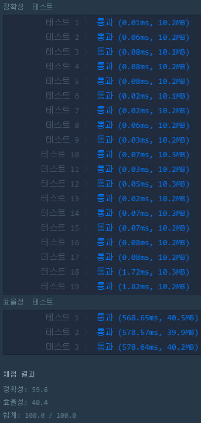

A problem that can be solved with kind of dynamic programming(Memoization).

<br>

# 가장 큰 정사각형 찾기

- 사용한 알고리즘: DP

- 생각하기 어려운 문제였다.
    - 주변 세 칸 중 가장 작은 정사각형의 크기에 현재 칸을 더하는 게 핵심
    - python을 가지고 index로 푼 게 좀 찜찜하지만 이 알고리즘으로는 이 방법밖에 없을 것 같다.
    - 다른 풀이 방법이 있다면 꼭 듣고 싶다.

```python
from itertools import chain
def solution(board):
    for i in range(1, len(board)):
        for j in range(1, len(board[0])):
            minimum = min(board[i-1][j-1], board[i-1][j], board[i][j-1])
            if board[i][j]:
                board[i][j] = max(board[i][j], minimum + 1)
    return max(list(chain.from_iterable(board))) ** 2
```



## 2D list → 1D list

- 마지막에 이중리스트 요소 중 가장 큰 값을 찾을 때
1차원 리스트로 만든 후 `max` 취함

- ✨ **참고사이트** (매우 유용했다. 다음에도 볼 것)
    - [https://programmers.co.kr/learn/courses/4008/lessons/12738](https://programmers.co.kr/learn/courses/4008/lessons/12738)
    (src: 파이썬을 파이썬답게/프로그래머스)
    - [https://winterj.me/list_of_lists_to_flatten/](https://winterj.me/list_of_lists_to_flatten/)
    (파이썬에서 2중 리스트를 flatten하게 만들기)

## `Numpy` flatten 함수 이용

- 위 두 번째 참고 사이트를 보면 `numpy`를 이용하는 것이 가장 빠르다고 한다. (이래서 딥러닝 모델엔 numpy를 쓰나 보다)
    - `Numpy` × 100   ≒ `itertools`
    - `Numpy` × 1000 ≒ `sum()`
- return문만 수정하면 다음과 같다.

```python
import numpy as np
def solution(board):
    for i in range(1, len(board)):
        for j in range(1, len(board[0])):
            minimum = min(board[i-1][j-1], board[i-1][j], board[i][j-1])
            if board[i][j]:
                board[i][j] = max(board[i][j], minimum + 1)
    return max(np.array(board).flatten().tolist()) ** 2
```


- `itertools` 보다 느리고 메모리도 많이 사용한다 ;;ㅅ;;
    - programmers 컴파일러에서는 `numpy`를 다시 list로 바꾸는 코드가 필요하기 때문으로 추측된다.
- 이렇게 된 이상 가장 깔끔하게 생긴 `sum()`도 사용해 봐야 겠다

## `sum()` 사용

- 마찬가지로 return문만 수정했다.

```python
def solution(board):
    for i in range(1, len(board)):
        for j in range(1, len(board[0])):
            minimum = min(board[i-1][j-1], board[i-1][j], board[i][j-1])
            if board[i][j]:
                board[i][j] = max(board[i][j], minimum + 1)
    return max(sum(board, [])) ** 2
```


- 효율성 테스트가 통과되지 않았다
    - 적은 데이터일 경우 `sum()`이 훨씬 깔끔하고 성능도 차이나지 않는다.
    - 하지만 빅데이터를 가지고 딥러닝을 할 때는 지금처럼 계속 `numpy`를 쓰는 게 좋겠다.
    - 코딩테스트에서는 무난하게 `itertools`나 를 써야겠다.
    - 아니면 list comprehension을 쓰면 다음과 같다.

## List comprehension 사용 시

```python
def solution(board):
    for i in range(1, len(board)):
        for j in range(1, len(board[0])):
            minimum = min(board[i-1][j-1], board[i-1][j], board[i][j-1])
            if board[i][j]:
                board[i][j] = max(board[i][j], minimum + 1)
    return max([y for x in board for y in x]) ** 2
```


